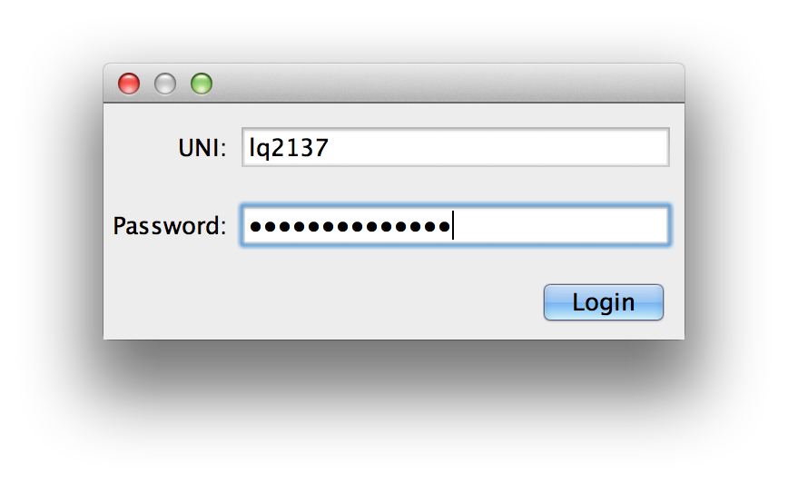
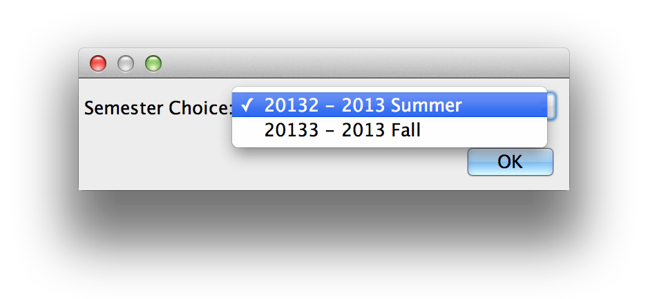
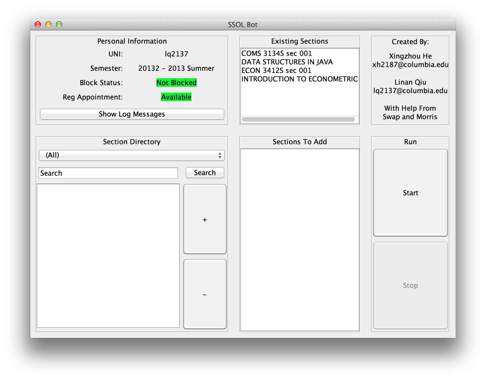
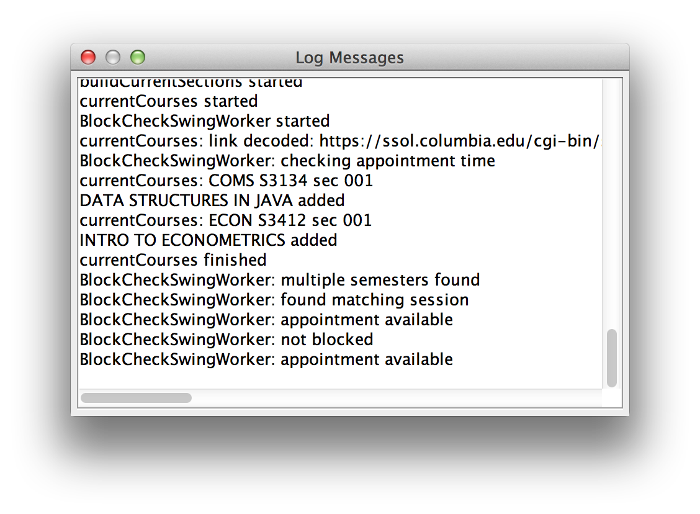
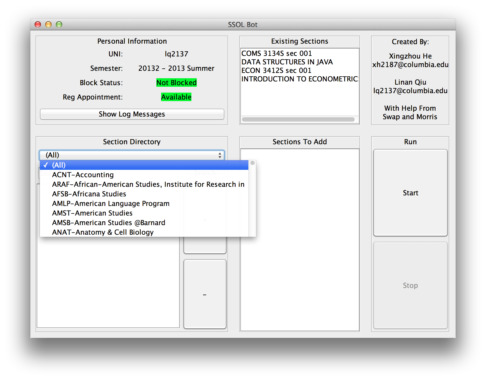
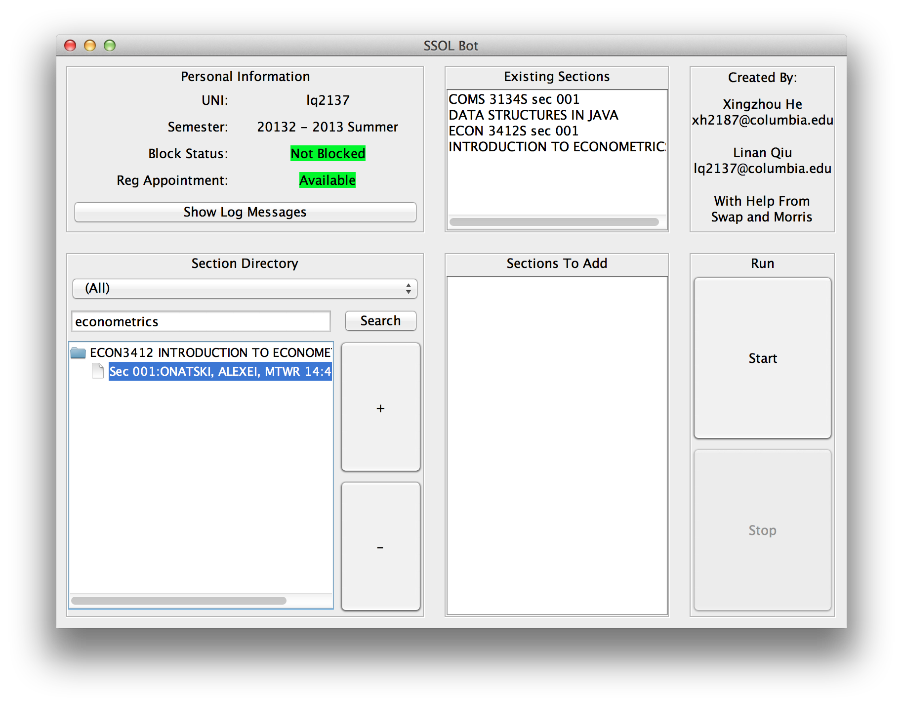
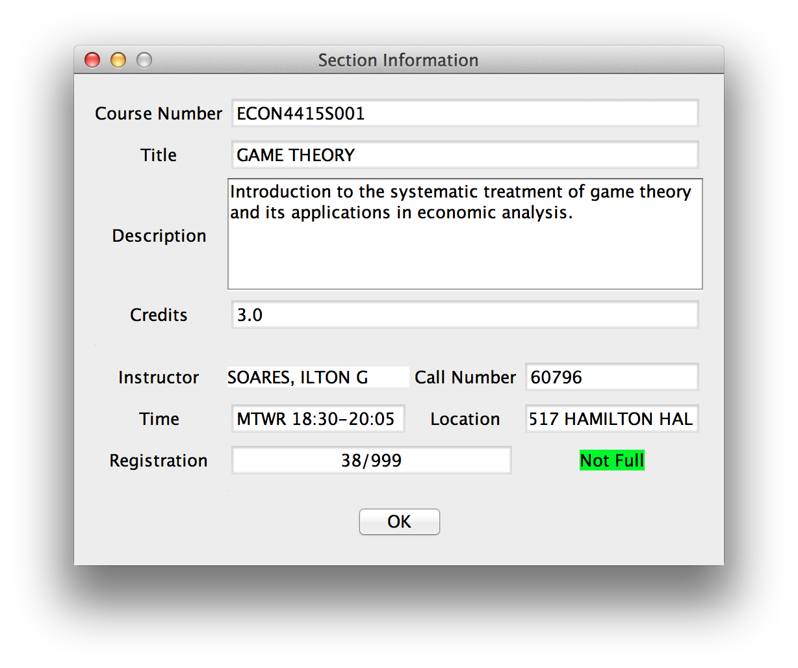
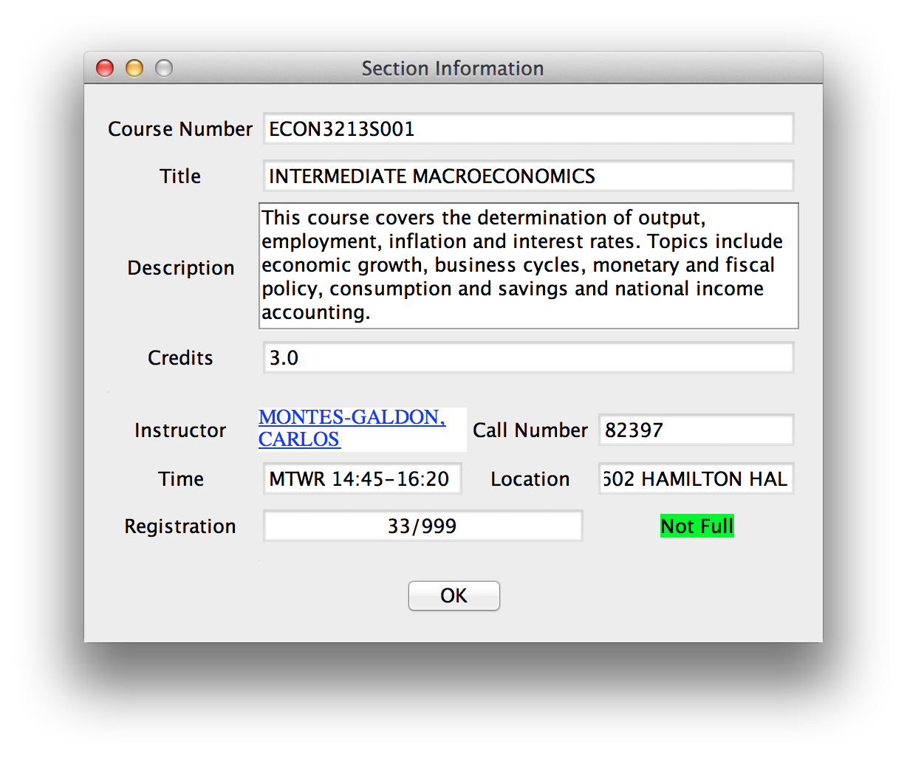
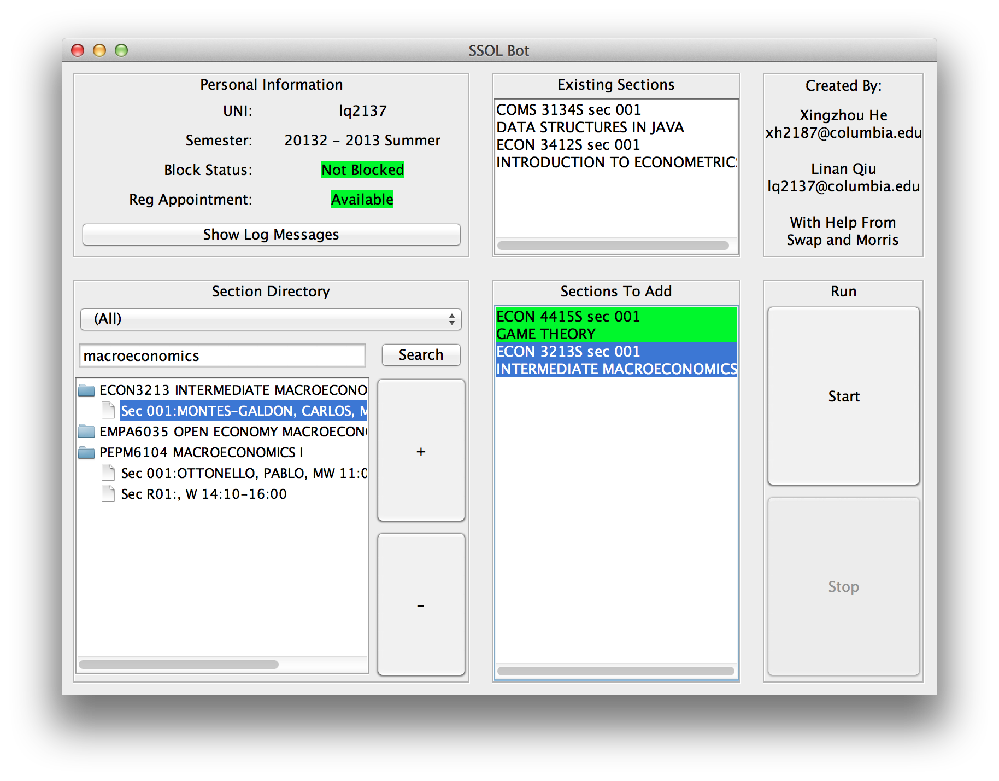
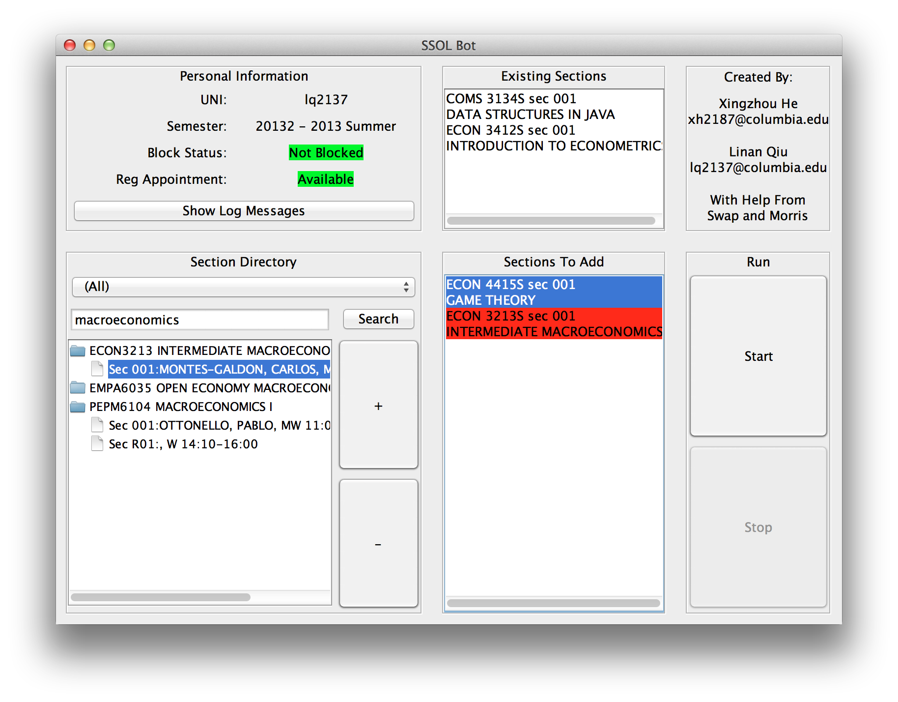

# User Manual
github.com/linanqiu/ssol-courses

By Xingzhou He and Linan Qiu

## Features
- Signs up for courses on SSOL automatically (and keeps retrying for courses that are full till you get them. No more clicking frenzy on sign up day!)
- Retries until you get the course
- Fetches courses from bulletin automatically (done live from Columbia Bulletin using ADI Courses API)
- Searches courses via keywords and departments (done live from Columbia Bulletin using ADI Courses API)
- Fetches Departments from Columbia Website (done live from Columbia website)
- Professors with CULPA reviews are indicated and linked to CULPA (done live from CULPA)
- Optimized timing to prevent SSOL IP Block
- IP Block Check
- Registration Appointment Timing Check

In other words, we didn't read anything off a text file. Everything should be updated live.

## Dependencies
- Selenium WebDriver
- Gson
- MIGLayout
- Java 1.6

## Quick Start
### Login

Log in by typing in your UNI and password. If wrong combination is entered, a notice will be shown.

### Choose Semester

If you have the option of two semesters (for example, Summer 2013 and Fall 2013), you will be given a choice. If you only have one semester, this dialog will not show and your only semester will be chosen.

### Main Interface

You will now be at the main window. **Personal Information** section shows your UNI and your chosen semester. It also shows if you are blocked by SSOL. (Note: You will be blocked if you click too many times in a given time frame. While we optimized the program's timing to avoid that, SSOL is still an ass sometimes.) It also shows if you have a registration appointment available right now. 

You can also view log messages. We basically redirected System.out OutputStream to here.

You will also see your **current sections**. **Current Sections are only updated the night before, so it is only accurate as of midnight the previous registration day**. Blame SSOL.

**Section Directory** allows you to search for sections to add. You can either search by department using keywords or search in all departments using keywords.

In the **Course Listing**, Sections are categorized by courses, hence you won't be spammed by a 100 LitHum sections. 

Double clicking on any section (including the ones in existing sections, section directory and section to add) brings up the **Instructor Dialog**. This shows information about the instructor.

If the instructor is present on CULPA, his name will appear differently. Clicking on it brings up your browser straight to his CULPA page.

Clicking the "+" sign adds sections to the **Sections To Add** portion. Clicking "-" removes it from the portion.

Clicking **Start** runs the bot. The bot will attempt to get the classes for you on SSOL. If it is a success, the section will appear GREEN. 

If it is unsuccessful (probably because the course is full), it will appear yellow. If the course is not found, it will appear red. Green and red sections will be skipped every subsequent run. 

If the course is unsuccessful, the bot will keep retrying every 50 seconds. After all, this is the whole point of the program.
